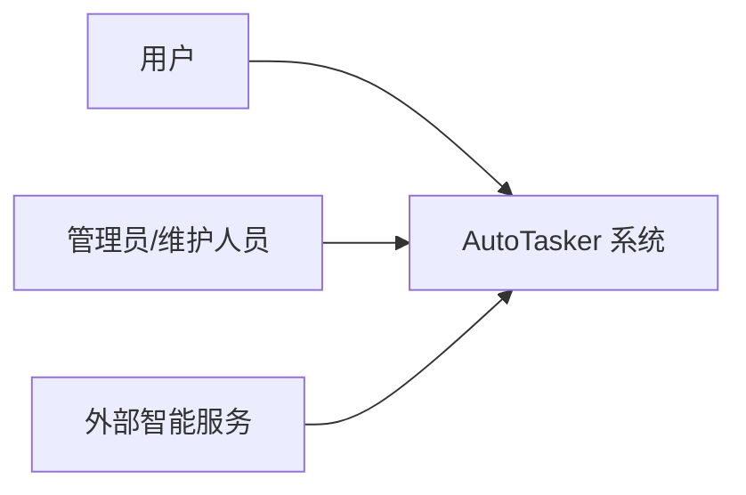
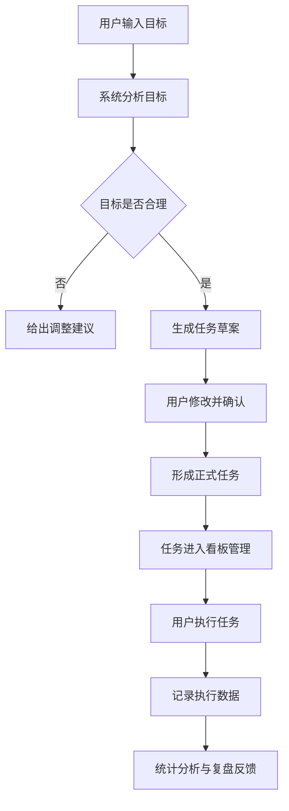
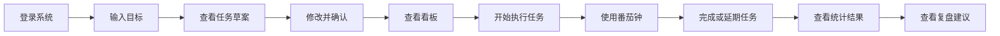
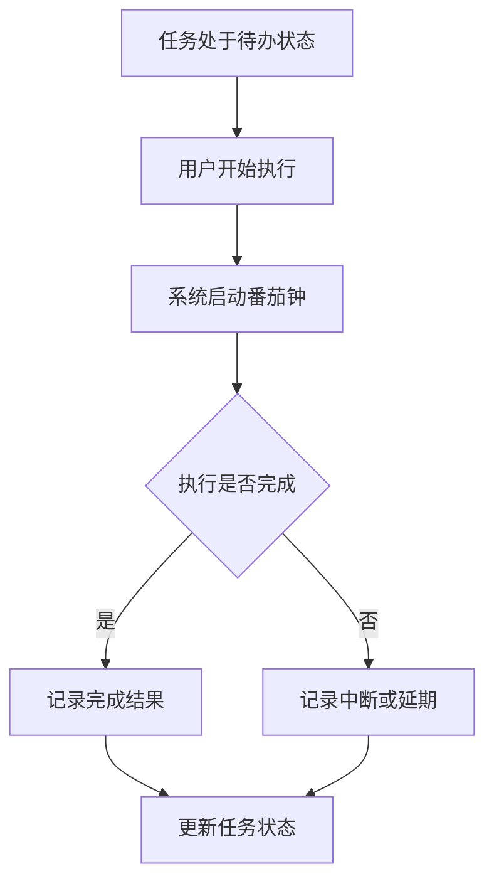
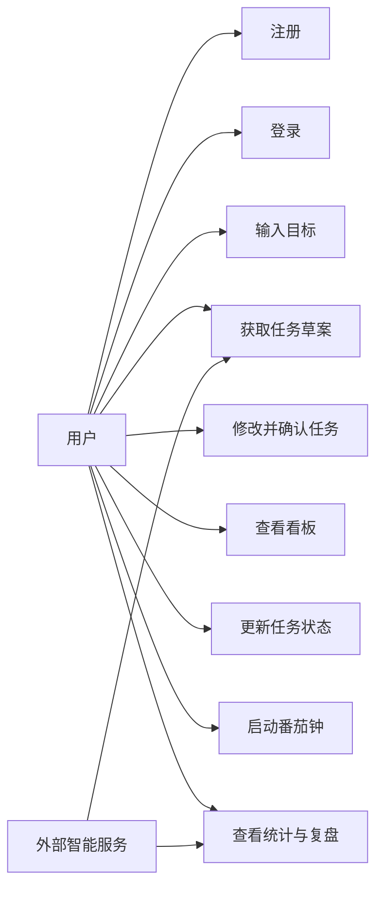
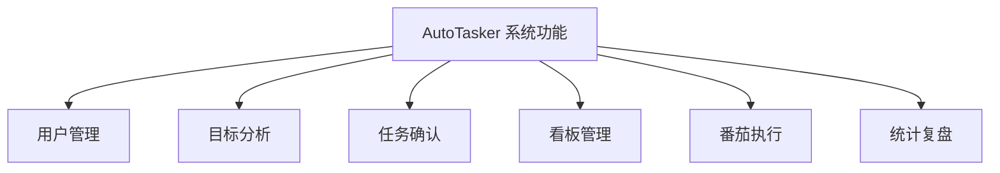
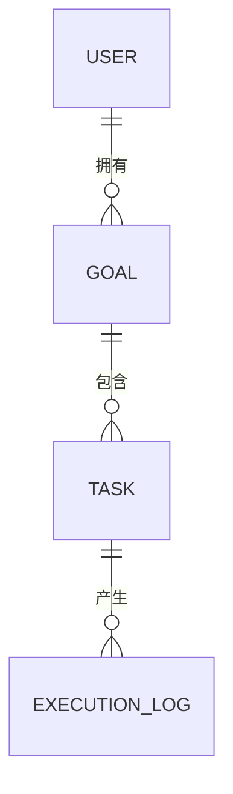

# AutoTasker 需求分析文档

文档名称：基于 LangChain 的智能任务拆解与自适应日程管理系统需求分析文档  
系统名称：AutoTasker  
版本号：V4.0  
编写日期：2026-04-10  
文档性质：课程项目需求分析说明书

---

## 1. 引言

### 1.1 编写目的

本需求分析文档用于全面描述 AutoTasker 系统的建设目标、业务背景、用户需求、功能范围、业务流程、数据需求和非功能需求，为后续概要设计、详细设计、编码实现、系统测试、项目验收和答辩展示提供依据。

本文件重点回答以下问题：

1. 该系统要解决什么问题。
2. 该系统面向哪些用户。
3. 用户如何使用该系统。
4. 系统必须具备哪些核心功能。
5. 系统在性能、可靠性、安全性和可维护性方面需要达到什么要求。

### 1.2 项目背景

在学习、备考、论文撰写和日常工作中，很多用户都存在“目标大、计划粗、执行难、复盘弱”的普遍问题。传统待办系统通常只能支持简单的任务记录，难以帮助用户完成以下关键环节：

- 将模糊目标拆解为具体可执行的小任务
- 根据时间约束合理安排任务顺序
- 对执行过程进行连续跟踪
- 在任务延期后给出合理调整
- 在任务完成后形成数据化总结

为解决上述问题，项目拟开发一套基于智能分析能力的 Web 任务规划与看板系统 AutoTasker。该系统能够从用户输入的自然语言目标出发，生成任务草案，经用户确认后形成正式任务，并通过看板和番茄钟支持执行过程管理，最终生成阶段性复盘结果。

### 1.3 项目名称

基于 LangChain 的智能任务拆解与自适应日程管理系统（AutoTasker）

### 1.4 读者对象

本文件的主要读者包括：

- 课程指导教师与评审人员
- 项目组成员
- 负责后续维护与扩展的开发人员

### 1.5 参考资料

| 序号 | 文件名称 | 说明 |
| --- | --- | --- |
| 1 | 《Web项目开发》课程项目任务书 | 项目来源依据 |
| 2 | 《Web项目开发》课程实施计划（2025-2026-2） | 项目实施周期依据 |
| 3 | 《基于AI agent的 Web 目标规划与看板系统》 | 项目计划相关材料 |
| 4 | 《基于 LangChain 的智能任务拆解与自适应日程管理系统（AutoTasker）需求分析报告》 | 原始需求资料 |
| 5 | GB/T 9385-2008《计算机软件需求规格说明规范》 | 文档规范参考 |
| 6 | 用户提供的 Requirement Statements 模板页面 | 本次文档结构参考 |

### 1.6 术语说明

| 术语 | 含义 |
| --- | --- |
| 宏观目标 | 用户输入的较大范围目标，如“完成期末复习” |
| 子任务 | 系统拆解生成的具体任务 |
| 暂存区 | 系统生成任务草案但尚未正式保存的区域 |
| 看板 | 按状态管理任务的可视化界面 |
| 番茄钟 | 用于辅助专注执行的倒计时工具 |
| 复盘 | 对任务完成和执行数据进行总结分析 |
| 用户偏好 | 用户设置的休息时间、专注时长等个性化信息 |

---

## 2. 任务概述

### 2.1 项目目标

AutoTasker 的建设目标如下：

1. 帮助用户把模糊、笼统的目标转化为清晰、可执行的小任务。
2. 帮助用户形成从“制定计划”到“执行任务”再到“结果复盘”的完整闭环。
3. 降低用户在任务拆解、时间安排和执行跟踪过程中的认知负担。
4. 提高用户对计划执行的参与感和掌控感。
5. 为后续学习与工作安排提供数据支持和行为反馈。

### 2.2 建设意义

本项目不仅具有课程实践价值，也具有一定的实际应用意义：

- 在软件工程层面，可以展示需求分析、系统设计、前后端协同和文档规范能力。
- 在应用层面，可以体现智能技术在学习与工作管理场景中的落地价值。
- 在用户体验层面，可以提升个人任务规划工具的主动辅助能力。

### 2.3 用户特征

#### 2.3.1 主要用户

主要用户为具备基础计算机使用能力的学生和普通个人用户。

#### 2.3.2 用户特点

1. 用户通常可以说出自己的大目标，但难以进一步细分任务。
2. 用户希望系统给出建议，但又不愿完全失去控制权。
3. 用户希望系统简单直观，不希望使用过程过于复杂。
4. 用户对任务进度提醒、延期调整和阶段总结有较强需求。

### 2.4 使用环境

1. 用户通过浏览器访问系统。
2. 系统主要运行在个人电脑环境下。
3. 用户需要具备基本网络连接条件。
4. 系统使用场景包括学习规划、考试准备、论文写作和日常工作安排。

### 2.5 约束条件

1. 本项目为课程项目，优先满足演示和答辩需求。
2. 系统以 Web 应用形式提供服务。
3. 系统功能应以个人任务规划场景为主，不涉及复杂团队协作。
4. 系统的智能分析能力依赖外部智能服务支持。

---

## 3. 现行业务与问题分析

### 3.1 现有方式

目前用户通常采用以下方式进行任务安排：

- 使用纸质笔记记录待办事项
- 使用手机备忘录记录任务
- 使用日历工具安排日期
- 使用普通 Todo List 应用管理进度

### 3.2 现有方式存在的问题

| 问题编号 | 问题描述 |
| --- | --- |
| P-01 | 用户面对较大的目标时，难以拆解出可操作步骤 |
| P-02 | 传统工具多以“记录”为主，缺乏分析和建议能力 |
| P-03 | 用户制定计划后，执行过程缺乏有效支撑 |
| P-04 | 任务延期后没有合理的重新安排机制 |
| P-05 | 用户完成任务后很难从数据角度了解自己的执行情况 |

### 3.3 目标系统的改进点

相较于传统任务管理方式，AutoTasker 需要提供以下改进：

1. 支持自然语言目标输入。
2. 支持系统自动生成任务草案。
3. 支持用户对草案进行修改和确认。
4. 支持可视化看板任务管理。
5. 支持任务执行过程记录。
6. 支持根据执行结果形成复盘反馈。

---

## 4. 业务角色分析

### 4.1 业务角色

| 角色 | 说明 |
| --- | --- |
| 用户 | 使用系统制定计划、管理任务、执行任务和查看复盘结果 |
| 管理员/维护人员 | 负责系统配置、数据维护和环境管理 |
| 外部智能服务 | 为系统提供目标分析和任务拆解支持 |

### 4.2 角色关系图

### 4.3 角色职责说明

#### 用户职责

- 注册和登录系统
- 输入目标
- 查看并确认任务草案
- 使用看板管理任务
- 启动番茄钟执行任务
- 查看统计与复盘结果

#### 管理员/维护人员职责

- 管理系统运行环境
- 检查日志和故障信息
- 维护系统配置

#### 外部智能服务职责

- 协助分析用户输入的目标
- 协助生成任务草案
- 协助生成复盘建议

---

## 5. 业务流程分析

### 5.1 总体业务流程图

### 5.2 用户活动流程图

### 5.3 任务执行流程图

---

## 6. 用例分析

### 6.1 用例总体说明

系统核心用例包括：

- 用户注册
- 用户登录
- 输入目标
- 获取任务草案
- 修改并确认任务
- 查看看板
- 更新任务状态
- 启动番茄钟
- 查看统计与复盘

### 6.2 用例图

### 6.3 关键用例说明

#### UC-01 用户注册

| 项目 | 内容 |
| --- | --- |
| 用例名称 | 用户注册 |
| 参与者 | 用户 |
| 前置条件 | 用户进入系统首页 |
| 后置条件 | 系统成功创建用户账号 |
| 基本事件流 | 1. 用户输入用户名和密码。2. 用户提交注册请求。3. 系统校验信息合法性。4. 系统保存用户信息。5. 系统提示注册成功。 |
| 异常事件流 | 1. 用户名已存在时，系统提示重新输入。2. 输入格式不正确时，系统提示修改。 |

#### UC-02 用户登录

| 项目 | 内容 |
| --- | --- |
| 用例名称 | 用户登录 |
| 参与者 | 用户 |
| 前置条件 | 用户已注册账号 |
| 后置条件 | 用户成功进入系统主界面 |
| 基本事件流 | 1. 用户输入用户名和密码。2. 用户提交登录请求。3. 系统验证身份。4. 登录成功后跳转到主界面。 |
| 异常事件流 | 1. 用户名或密码错误时，系统提示重新输入。 |

#### UC-03 输入目标

| 项目 | 内容 |
| --- | --- |
| 用例名称 | 输入目标 |
| 参与者 | 用户 |
| 前置条件 | 用户已登录系统 |
| 后置条件 | 系统接收到目标内容并进入分析流程 |
| 基本事件流 | 1. 用户进入目标输入区域。2. 用户输入自然语言目标。3. 用户点击提交。4. 系统开始分析目标。 |
| 异常事件流 | 1. 目标为空时，系统提示重新输入。2. 目标内容明显不合理时，系统返回修改建议。 |

#### UC-04 获取任务草案

| 项目 | 内容 |
| --- | --- |
| 用例名称 | 获取任务草案 |
| 参与者 | 用户 |
| 前置条件 | 用户已成功提交目标 |
| 后置条件 | 系统返回任务草案或调整建议 |
| 基本事件流 | 1. 系统分析目标内容。2. 系统结合用户偏好生成草案。3. 系统将草案展示在暂存区。 |
| 异常事件流 | 1. 分析失败时，系统提示稍后重试。2. 智能服务异常时，系统给出失败提示。 |

#### UC-05 修改并确认任务

| 项目 | 内容 |
| --- | --- |
| 用例名称 | 修改并确认任务 |
| 参与者 | 用户 |
| 前置条件 | 暂存区中已有系统生成的任务草案 |
| 后置条件 | 草案任务变为正式任务并进入看板 |
| 基本事件流 | 1. 用户查看草案。2. 用户修改任务内容。3. 用户确认保存。4. 系统生成正式任务。 |
| 异常事件流 | 1. 保存失败时，系统提示重新提交。 |

#### UC-08 启动番茄钟

| 项目 | 内容 |
| --- | --- |
| 用例名称 | 启动番茄钟 |
| 参与者 | 用户 |
| 前置条件 | 用户有可执行任务 |
| 后置条件 | 系统记录本次执行结果 |
| 基本事件流 | 1. 用户从看板中选择任务。2. 用户开始执行任务。3. 系统启动番茄钟。4. 用户完成、暂停或延期任务。5. 系统记录执行情况。 |
| 异常事件流 | 1. 用户中途中断任务时，系统记录未完成状态。2. 多次延期后，系统进行失败提醒。 |

---

## 7. 功能需求分析

### 7.1 功能结构图

### 7.2 用户管理功能需求

1. 系统应支持用户注册。
2. 系统应支持用户登录。
3. 系统应支持保存和读取用户个人偏好。
4. 系统应支持用户修改专注时长和休息时间设置。

### 7.3 目标分析功能需求

1. 系统应支持用户输入自然语言目标。
2. 系统应支持对目标进行合理性分析。
3. 当目标不合理时，系统应提示用户缩小目标范围。
4. 当目标合理时，系统应生成任务草案。

### 7.4 任务确认功能需求

1. 系统应把任务草案展示在暂存区。
2. 用户应能够查看任务名称和计划时间。
3. 用户应能够修改任务内容。
4. 用户应能够确认或放弃草案。
5. 用户确认后，系统应生成正式任务。

### 7.5 看板管理功能需求

1. 系统应以看板形式展示正式任务。
2. 系统应至少包含待办、进行中、已完成三类状态栏目。
3. 系统应支持任务状态更新。
4. 系统应对逾期任务进行高亮提醒。

### 7.6 番茄执行功能需求

1. 系统应支持用户开始任务执行。
2. 系统应提供番茄钟功能辅助任务执行。
3. 系统应记录执行时长和执行结果。
4. 当任务未完成时，系统应支持任务延期。
5. 当任务延期次数过多时，系统应给出失败提醒。

### 7.7 统计复盘功能需求

1. 系统应记录任务完成情况。
2. 系统应统计任务延期情况和专注情况。
3. 系统应提供统计结果页面。
4. 系统应给出阶段性复盘建议。

---

## 8. 数据需求分析

### 8.1 主要数据对象

| 数据对象 | 说明 |
| --- | --- |
| 用户信息 | 保存账号信息和个性化设置 |
| 目标信息 | 保存用户输入的宏观目标 |
| 任务信息 | 保存正式任务内容及状态 |
| 草案信息 | 保存尚未确认的任务草案 |
| 执行记录 | 保存番茄钟执行和任务执行情况 |
| 复盘结果 | 保存统计结果和分析建议 |

### 8.2 数据关系图

### 8.3 数据需求说明

1. 系统应保存每个用户的基本信息和个性设置。
2. 系统应保存用户输入的目标。
3. 系统应保存目标对应的多个任务。
4. 系统应保存任务状态、任务时间和任务执行结果。
5. 系统应保存任务执行过程中的统计信息。
6. 系统应支持根据用户维度查看历史数据。

---

## 9. 界面需求分析

### 9.1 总体界面要求

系统界面应简洁明了，便于用户理解和操作。整体界面建议由以下区域构成：

1. 用户信息和功能导航区域
2. 目标输入区域
3. 任务草案区域
4. 看板区域
5. 番茄钟区域
6. 统计与复盘区域

### 9.2 主要界面说明

#### 登录界面

- 提供用户名和密码输入框
- 提供登录入口
- 提供注册入口

#### 目标输入界面

- 提供目标输入框
- 提供提交按钮
- 提供提示信息区域

#### 暂存区界面

- 展示系统生成的草案任务
- 支持用户修改任务内容
- 支持用户确认保存

#### 看板界面

- 展示待办、进行中、已完成等任务栏
- 展示任务名称和状态
- 支持任务状态变化

#### 统计复盘界面

- 展示任务完成情况
- 展示延期和专注统计结果
- 展示复盘建议

---

## 10. 非功能需求分析

### 10.1 易用性需求

1. 系统应尽量减少用户输入复杂度。
2. 系统应通过清晰的界面结构帮助用户理解业务流程。
3. 系统的重要提示信息应明显可见。

### 10.2 性能需求

1. 系统应在合理时间内返回目标分析结果。
2. 系统应在普通使用规模下保持较顺畅的界面交互。
3. 系统应在可接受时间内完成统计结果展示。

### 10.3 可靠性需求

1. 当外部智能服务暂时不可用时，系统应向用户明确提示。
2. 当保存任务失败时，系统应避免产生错误数据。
3. 当执行过程被中断时，系统应尽量减少用户数据丢失。

### 10.4 安全性需求

1. 系统应保护用户账户信息安全。
2. 系统应防止未授权用户访问他人数据。
3. 系统应避免明显敏感信息被不必要地传递。

### 10.5 可维护性需求

1. 系统结构应清晰，便于后续扩展。
2. 系统应保留必要的运行日志。
3. 系统应便于后期增加新的分析和展示功能。

---

## 11. 需求优先级分析

### 11.1 高优先级需求

- 用户注册与登录
- 输入目标并生成任务草案
- 用户确认草案生成正式任务
- 看板展示任务
- 番茄钟执行与记录

### 11.2 中优先级需求

- 逾期提醒
- 延期处理
- 用户偏好设置
- 统计结果展示

### 11.3 低优先级需求

- 更深入的复盘建议
- 更丰富的统计方式
- 更多界面扩展功能

---

## 12. 验收标准

系统验收应至少满足以下要求：

1. 用户能够完成注册和登录。
2. 用户能够输入目标并得到任务草案。
3. 用户能够修改和确认草案任务。
4. 正式任务能够进入看板进行管理。
5. 用户能够使用番茄钟执行任务。
6. 系统能够展示任务统计与复盘结果。

---

## 13. 结论

通过本需求分析，可以明确 AutoTasker 的核心任务是帮助用户完成从目标提出、任务拆解、计划确认、执行管理到结果复盘的完整过程。本文档从业务角度分析了系统的建设背景、用户特点、业务流程、用例、功能需求、数据需求、界面需求和非功能需求，并通过用例图、流程图、功能结构图和数据关系图对系统需求进行了较完整的表达，可作为后续概要设计与系统实现的重要依据。
